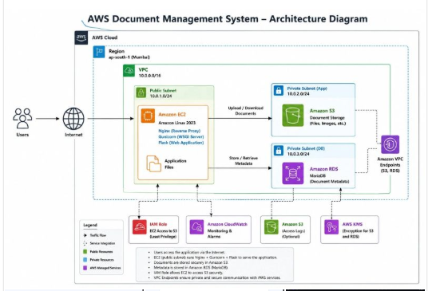
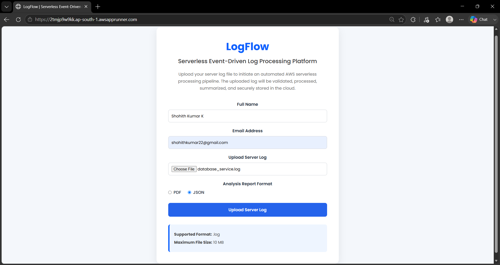
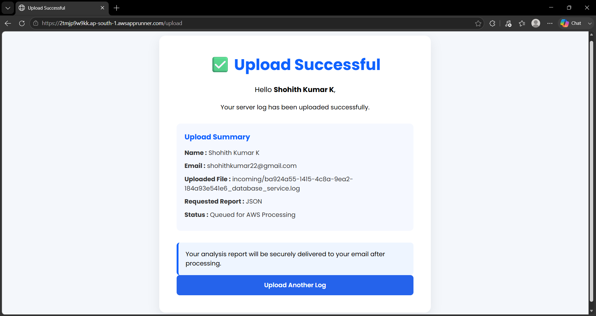
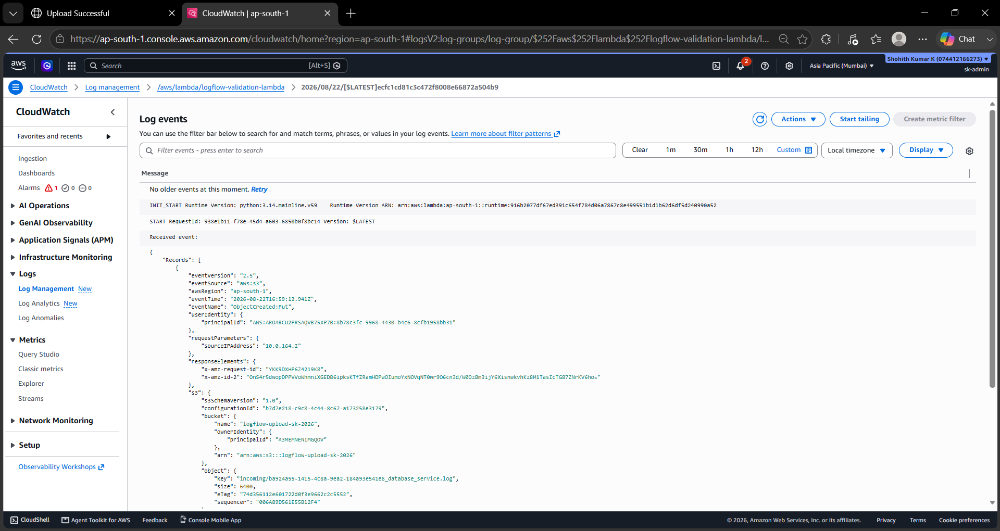
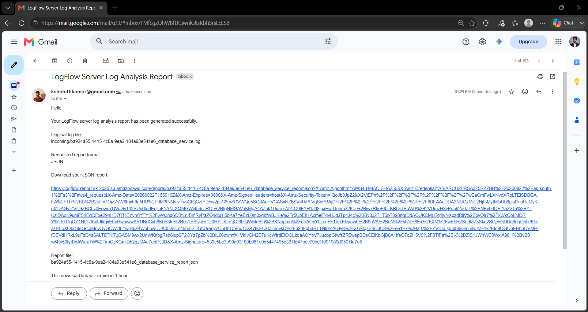
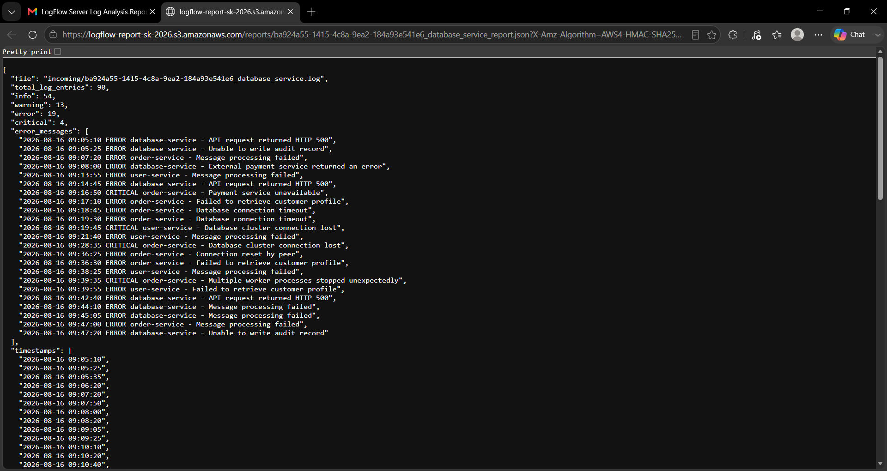

# 📚 LogFlow

A serverless **event-driven server log processing platform** built using **Flask**, **Docker**, **AWS App Runner**, **Amazon S3**, **AWS Lambda**, **Amazon SQS**, **Amazon SES**, **Amazon ECR**, **Amazon CloudWatch**, and **Terraform**.

The platform allows users to upload `.log` files, select a report format (**PDF or JSON**), automatically validate and process the uploaded logs, generate the requested analysis report, store the report in Amazon S3, and send the report download link to the user's email.

This project demonstrates building an event-driven serverless workflow on AWS using managed services instead of maintaining traditional application servers.

---

# 🚀 Features

* Upload server log files through a web application
* Accept `.log` files only
* Maximum upload size of 10 MB
* Collect user name and email address
* Select analysis report format: PDF or JSON
* Store uploaded logs in Amazon S3
* Validate uploaded files using AWS Lambda
* Pass validated processing jobs through Amazon SQS
* Analyze log entries automatically
* Count INFO, WARNING, ERROR, and CRITICAL entries
* Extract error messages and timestamps
* Generate JSON analysis reports
* Generate PDF analysis reports
* Store generated reports in Amazon S3
* Generate secure pre-signed download URLs
* Send report links through Amazon SES
* Monitor Lambda execution using Amazon CloudWatch
* Infrastructure provisioning using Terraform
* Containerized Flask application using Docker
* Deployment through Amazon ECR and AWS App Runner

---

# 🛠️ Technologies Used

### Frontend

* HTML5
* CSS3
* Jinja2 Templates

### Backend

* Python
* Flask

### Containerization

* Docker
* Amazon ECR

### AWS Services

* AWS App Runner
* Amazon S3
* AWS Lambda
* Amazon SQS
* Amazon SES
* Amazon CloudWatch
* AWS IAM

### Infrastructure as Code

* Terraform

### Development & Version Control

* Git
* GitHub
* Visual Studio Code

---

# 🏗️ System Architecture

```text
                         User
                           │
                           ▼
                    Web Browser
                           │
                           ▼
                 AWS App Runner
                  Flask Web App
                           │
                           ▼
                    Amazon S3
                  Upload Bucket
                  incoming/*.log
                           │
                           │ S3 Event
                           ▼
               Validation Lambda
                           │
                           │ Validated Job
                           ▼
                     Amazon SQS
                           │
                           ▼
               Processing Lambda
                           │
                  ┌────────┴────────┐
                  ▼                 ▼
            JSON Report        PDF Report
                  │                 │
                  └────────┬────────┘
                           ▼
                    Amazon S3
                  Report Bucket
                           │
                           ▼
                Pre-signed URL
                           │
                           ▼
                    Amazon SES
                           │
                           ▼
                    User Email
```

The infrastructure is provisioned and managed using **Terraform**.

---

# 📷 Project Screenshots

## Architecture Diagram



---

## Web Application



---

## Upload Successful



---

## Validation Lambda CloudWatch Logs



---

## Email Report Delivered



---

## Generated JSON Report



---

# 🔄 Workflow

### 1. Upload

The user opens the LogFlow web application, enters their name and email, uploads a `.log` file, and selects either **PDF** or **JSON** as the required report format.

### 2. S3 Storage

The Flask application uploads the log file to the Amazon S3 upload bucket under the `incoming/` prefix.

The selected report format and user's email are stored as S3 object metadata.

### 3. Validation

The S3 upload event triggers the validation Lambda.

The Lambda:

* Checks that the file is under `incoming/`
* Verifies that the file has a `.log` extension
* Checks the user's email metadata
* Checks that the uploaded file is not empty
* Sends the validated job to Amazon SQS

### 4. Queue

Amazon SQS decouples file validation from log processing.

The message contains:

* S3 bucket
* S3 object key
* User email
* Requested report format

### 5. Processing

The processing Lambda retrieves the original log file from S3 and analyzes its contents.

It identifies:

* INFO entries
* WARNING entries
* ERROR entries
* CRITICAL entries
* Error messages
* Timestamps

### 6. Report Generation

The analysis is converted into the requested report format.

* JSON reports contain the structured analysis data.
* PDF reports contain a readable analysis summary.

The generated report is stored in the S3 report bucket.

### 7. Email Notification

A pre-signed S3 download URL is generated for the selected report.

Amazon SES sends the URL to the user's email address.

The download link expires after one hour.

---

# ☁️ AWS Architecture Components

### AWS App Runner

Hosts the containerized Flask web application and provides a publicly accessible application endpoint.

### Amazon S3

Two logical storage purposes are used:

* Upload bucket for incoming `.log` files
* Report bucket for generated PDF and JSON reports

### AWS Lambda

Two Lambda functions implement the event-driven processing pipeline:

* **Validation Lambda**
* **Processing Lambda**

### Amazon SQS

Provides a queue between validation and processing so that the workflow is decoupled.

### Amazon SES

Sends the generated report download link to the user.

### Amazon CloudWatch

Stores Lambda execution logs for monitoring and troubleshooting.

### Amazon ECR

Stores the Docker image used by AWS App Runner.

### AWS IAM

Provides permissions required by the AWS services in the workflow.

---

# 📁 Project Structure

```text
logflow-serverless-file-processing-platform/
│
├── app/
│   ├── app.py
│   ├── s3_config.py
│   ├── requirements.txt
│   ├── Dockerfile
│   ├── templates/
│   └── static/
│
├── logflow-terraform/
│   ├── provider.tf
│   ├── s3.tf
│   ├── s3_lambda.tf
│   ├── lambda.tf
│   ├── sqs.tf
│   ├── event_source_mapping.tf
│   ├── iam.tf
│   ├── sns.tf
│   └── cloudwatch.tf
│
├── sample_logs/
│   ├── api_gateway.log
│   ├── database_service.log
│   ├── payment_service.log
│   └── security_events.log
│
├── screenshots/
│   ├── 01_logFlow_architecture_diagram.png
│   ├── 02_logflow_web_application.png
│   ├── 03_logflow_upload_successful.png
│   ├── 04_logflow_validation_lambda_cloudwatch.png
│   ├── 05_logflow_email_report_delivered.png
│   └── 06_logflow_generated_json_report.png
│
└── README.md
```

---

# ⚙️ Local Development

### Clone the Repository

```bash
git clone https://github.com/shohith-git/logflow-serverless-file-processing-platform.git
```

```bash
cd logflow-serverless-file-processing-platform
```

---

### Create a Virtual Environment

```bash
python -m venv venv
```

Activate the virtual environment.

**Windows**

```cmd
venv\Scripts\activate
```

---

### Install Dependencies

```bash
pip install -r app/requirements.txt
```

---

### Run the Flask Application

```bash
python app/app.py
```

The application can then be accessed locally through the Flask server.

---

# 🐳 Docker

Build the web application image:

```bash
docker build -t logflow-web:latest ./app
```

Run the container:

```bash
docker run -p 8080:8080 logflow-web:latest
```

The Docker image is pushed to **Amazon ECR** and deployed through **AWS App Runner**.

---

# 🏗️ Terraform Deployment

The AWS infrastructure is maintained under:

```text
logflow-terraform/
```

Initialize Terraform:

```bash
terraform init
```

Review the infrastructure plan:

```bash
terraform plan
```

Apply the infrastructure:

```bash
terraform apply
```

Terraform manages the AWS resources required for the LogFlow serverless processing workflow.

---

# 🧪 Testing

The complete workflow was tested using sample server log files.

Testing covered:

* `.log` file upload
* Report format selection
* S3 upload
* Validation Lambda execution
* SQS message delivery
* Processing Lambda execution
* JSON report generation
* PDF report generation
* S3 report storage
* Pre-signed download URL generation
* SES email delivery
* CloudWatch log verification

The website restricts uploads to `.log` files, providing basic input validation before the serverless processing workflow begins.

---

# 📊 Log Analysis

For each uploaded log file, LogFlow produces structured analysis containing:

```text
Total Log Entries
INFO
WARNING
ERROR
CRITICAL
Error Messages
Timestamps
Summary
```

The same analysis can be represented as a JSON report or a PDF report depending on the user's selection.

---

# 🔐 Security Considerations

* Uploaded files are restricted to `.log` format.
* Maximum upload size is limited to 10 MB.
* AWS IAM permissions are used for service access.
* Generated reports are accessed through pre-signed S3 URLs.
* Download URLs expire after one hour.
* Application secrets and sensitive configuration should be kept outside source control.

---

# 📖 Learning Outcomes

Through this project, I gained practical experience with:

* Designing event-driven AWS architectures
* Building serverless workflows using AWS Lambda
* Working with Amazon S3 event notifications
* Using Amazon SQS for decoupling services
* Generating and storing automated reports
* Sending emails using Amazon SES
* Monitoring serverless applications with CloudWatch
* Containerizing Flask applications with Docker
* Deploying containers using Amazon ECR and AWS App Runner
* Managing AWS infrastructure using Terraform
* Working with Git and GitHub for project version control

---

# 🌐 Deployment Summary

The LogFlow application uses a serverless, event-driven architecture.

The web application is containerized using Docker and deployed through **Amazon ECR** and **AWS App Runner**.

The processing pipeline uses:

* Amazon S3
* AWS Lambda
* Amazon SQS
* Amazon SES
* Amazon CloudWatch
* AWS IAM

Terraform is used to manage the AWS infrastructure.

---

# 👨‍💻 Developed By

**Shohith Kumar K**

GitHub: https://github.com/shohith-git

LinkedIn: https://www.linkedin.com/in/shohith-kumar-k-3875a2300

---

## ⭐ If you found this project useful, consider giving it a star.
